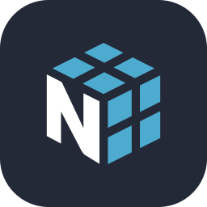
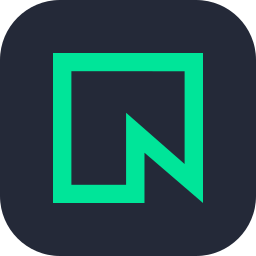

  

 

---

## 👨‍💻 About Me

 

&nbsp;&nbsp;🎓 &nbsp;CS Undergrad at **Ramdeobaba University, Nagpur**

&nbsp;&nbsp;🌱 &nbsp;Currently learning **Machine Learning** + **HuggingFace Transformers**

&nbsp;&nbsp;🤖 &nbsp;Exploring the intersection of **ML and real-world web products**

 

---

## 🛠️ Technology & Tools Arsenal

<table border="1" width="100%">

  <!-- Machine Learning & AI -->
  <tr>
    <td colspan="60" align="center">
      <h3>🤖 Machine Learning & AI</h3>
      
    </td>
  </tr>
  <tr>
    <td colspan="12" width="20%" align="center">
       
      Hugging Face
    </td>
    <td colspan="12" width="20%" align="center">
       
      scikit-learn
    </td>
    <td colspan="12" width="20%" align="center">
       
      Pandas
    </td>
    <td colspan="12" width="20%" align="center">
       
      NumPy
    </td>
    <td colspan="12" width="20%" align="center">
       
      Streamlit
    </td>
  </tr>

  <!-- Backend Development -->
  <tr>
    <td colspan="60" align="center">
      <h3>⚙️ Backend Development</h3>
    </td>
  </tr>
  <tr>
    <td colspan="15" width="25%" align="center">
       
      Node.js
    </td>
    <td colspan="15" width="25%" align="center">
       
      Express.js
    </td>
    <td colspan="15" width="25%" align="center">
       
      Python
    </td>
    <td colspan="15" width="25%" align="center">
       
      Streamlit
    </td>
  </tr>

  <!-- Frontend Development -->
  <tr>
    <td colspan="60" align="center">
      <h3>🖥️ Frontend Development</h3>
    </td>
  </tr>
  <tr>
    <td colspan="15" width="25%" align="center">
       
      Next.js
    </td>
    <td colspan="15" width="25%" align="center">
       
      React
    </td>
    <td colspan="15" width="25%" align="center">
       
      Tailwind CSS
    </td>
    <td colspan="15" width="25%" align="center">
       
      JavaScript
    </td>
  </tr>

  <!-- Database & Cloud -->
  <tr>
    <td colspan="60" align="center">
      <h3>🗄️ Database & Cloud</h3>
    </td>
  </tr>
  <tr>
    <td colspan="15" width="25%" align="center">
       
      MongoDB
    </td>
    <td colspan="15" width="25%" align="center">
       
      Neon DB
    </td>
    <td colspan="15" width="25%" align="center">
       
      PostgreSQL
    </td>
    <td colspan="15" width="25%" align="center">
       
      Cloudinary
    </td>
  </tr>

  <!-- Programming & Hardware Languages -->
  <tr>
    <td colspan="60" align="center">
      <h3>💻 Programming & Hardware Languages</h3>
    </td>
  </tr>
  <tr>
    <td colspan="12" width="20%" align="center">
       
      C++
    </td>
    <td colspan="12" width="20%" align="center">
       
      C
    </td>
    <td colspan="12" width="20%" align="center">
       
      Java
    </td>
    <td colspan="12" width="20%" align="center">
       
      Python
    </td>
    <td colspan="12" width="20%" align="center">
       
      SystemVerilog
    </td>
  </tr>

  <!-- Tools & Platforms -->
  <tr>
    <td colspan="60" align="center">
      <h3>🔧 Tools & Platforms</h3>
    </td>
  </tr>
  <tr>
    <td colspan="15" width="25%" align="center">
       
      Git
    </td>
    <td colspan="15" width="25%" align="center">
       
      GitHub
    </td>
    <td colspan="15" width="25%" align="center">
       
      Render
    </td>
    <td colspan="15" width="25%" align="center">
       
      Vercel
    </td>
  </tr>

</table>

---

## ⚡ Coding Profiles

 

&nbsp;&nbsp;

 

---

## 📊 GitHub Stats & Activity

 

&nbsp;

  

  

 

  

